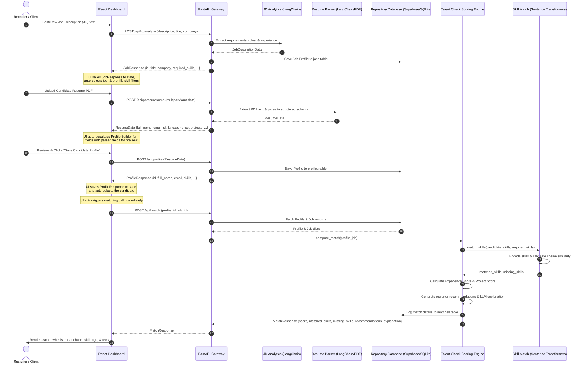

# Talent Match Platform: E2E Pipeline Data Flow

This document details the automated execution pipeline of the Talent Match Platform, tracing data from raw inputs (pasted JDs and resume PDFs) to the final similarity matching dashboard.

---

## 1. Pipeline Execution Flow



---

## 2. Step-by-Step Data Integration Details

### Step 2.1: JD Analytics (`POST /api/jd/analyze`)
* **Input**: `{ "description": "Raw pasted text of job description..." }`
* **Output**: `JobResponse` Pydantic model (inherits from `JobDescriptionData` with a unique database `id` field).
* **Next Connection**: The frontend updates its `jobs` state:
  ```javascript
  setJobs(prev => [response.data, ...prev]);
  setSelectedJobId(response.data.id);
  ```
  This guarantees the dashboard uses the database-generated ID rather than generating a client-side mock ID.

### Step 2.2: Resume Parser (`POST /api/parser/resume`)
* **Input**: Multipart file upload containing the PDF resume binary.
* **Output**: `ResumeData` Pydantic model (names, emails, skill tags, arrays of education, experience, and project details).
* **Next Connection**: The frontend automatically maps this response to the Profile Builder input forms, eliminating manual JSON editing or copy-pasting.

### Step 2.3: Profile Builder (`POST /api/profile`)
* **Input**: `ResumeData` body representing the edited candidate profile details.
* **Output**: `ProfileResponse` containing the database-registered unique `id` and the profile payload.
* **Next Connection**: The frontend updates its `profiles` state, auto-selects this new candidate, and immediately dispatches the match request.

### Step 2.4: Talent Check & Matching (`POST /api/match`)
* **Input**: `{ "profile_id": "...", "job_id": "..." }`
* **Processing**:
  * Decouples matching logic from specific DB connections.
  * Resolves cosine similarity lists locally on the CPU using `sentence-transformers/all-MiniLM-L6-v2`.
  * Merges experience metrics and project matches to create a weighted rating.
* **Output**: `MatchResponse` (containing scores, recommendations list, and the semantic explanation).
* **Result**: Renders in the glassmorphic analytics interface on the dashboard.
